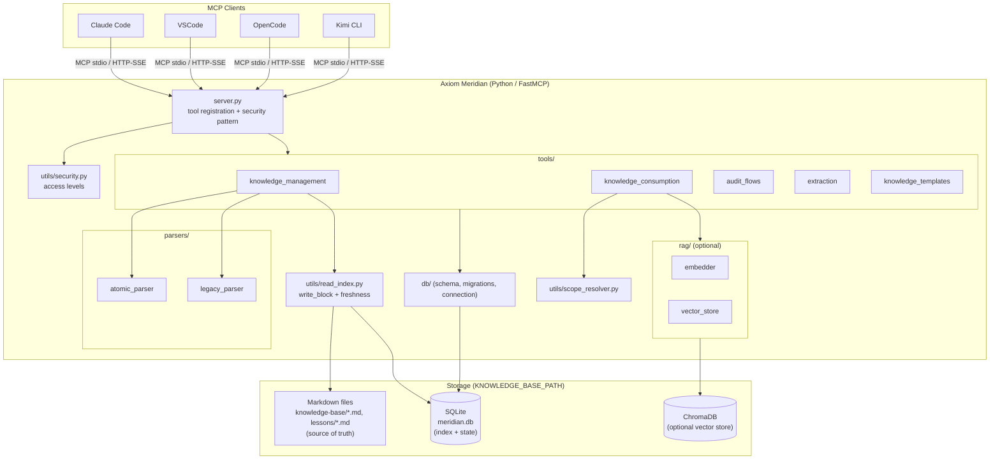
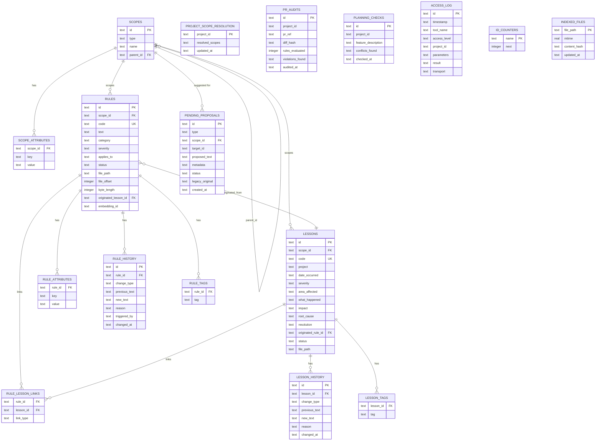

## Index

0. [Project fact sheet](#0-project-fact-sheet)
1. [General product description](#1-general-product-description)
2. [System architecture](#2-system-architecture)
3. [Data model](#3-data-model)
4. [API specification](#4-api-specification)
5. [User stories](#5-user-stories)
6. [Work tickets](#6-work-tickets)
7. [Pull requests](#7-pull-requests)

---

## 0. Project fact sheet

### **0.1. Your full name:**

Juan Manuel Rojas González ([abeljumanuel.rojas@gmail.com](mailto:abeljumanuel.rojas@gmail.com))

### **0.2. Project name:**

Axiom Meridian — *"Code drifts. Meridian doesn't."*

### **0.3. Brief project description:**

An MCP (Model Context Protocol) server that centralizes a team's institutional technical knowledge — coding rules and lessons learned — and delivers only the slice relevant to the current task, instead of forcing AI agents to read entire knowledge-base files on every session.

### **0.4. Project URL:**

Not applicable (MCP) — Axiom Meridian is an MCP server for local use (stdio) or, optionally, HTTP/SSE bound to `127.0.0.1`; there is no publicly reachable deployment URL.

### 0.5. Repository URL or compressed file

[https://github.com/abeljumanuel/axiom-meridian-project](https://github.com/abeljumanuel/axiom-meridian-project)

---

## 1. General product description

### **1.1. Objective:**

Teams that work with AI coding agents accumulate institutional knowledge as long Markdown files: coding standards per language/framework, architecture decisions, and "lessons learned" from production incidents. This works while the files are small, but as they grow it creates three problems: every agent session re-reads the whole file even when only two or three rules apply to the current task (context and latency cost), relevance is all-or-nothing (there's no notion of "this project uses Quarkus, that one uses Spring Boot"), and there is no governance (anyone can edit the file directly, with no review or traceability).

Axiom Meridian solves this by indexing rules (`RN-*`) and lessons (`LL-*`) in an atomic block format, resolving a **scope hierarchy** (`project → framework → language → global`) to decide what applies to a given project, and serving only that filtered subset — optionally ranked by semantic relevance — through typed MCP tools. The Markdown files remain the single source of truth, and every change goes through explicit human approval.

More detail in [Project Charter](docs/01-project-charter.md) and [Product Description](docs/02-product-description.md).

### **1.2. Key features and functionality:**

1. **Scoped knowledge queries** — `query_rules` / `query_lessons` resolve a project's effective scope chain, apply category/severity/tag filters, and return only active, matching entries.
2. **Atomic, traceable format** — every rule or lesson is a self-contained Markdown block (`## RN-JAVA-011`, `## LL-PSP-003`) with structured fields, deterministically parseable and indexable.
3. **Governed lifecycle** — extraction and legacy-file migration never write directly to active knowledge; everything lands first in `pending_proposals`, and `approve_proposal` promotes the change to the Markdown file and the SQLite index in a single transaction.
4. **PR and feature auditing** — `audit_pr` surfaces the relevant rules/lessons before a merge; `check_feature_against_rules` does the same during the planning phase.
5. **Meeting transcript extraction** — `extract_rules_from_transcript` / `extract_lessons_from_transcript` turn meeting notes into candidate proposals.
6. **Hybrid retrieval (SQL + RAG)** — when embeddings exist, queries rank by semantic similarity (`BAAI/bge-small-en-v1.5` via ChromaDB); when they don't, it transparently falls back to SQL filtering, without changing the tool's signature.
7. **Access control and audit log** — every tool is gated by an access level (`read` / `analyze` / `write`); every invocation is recorded, excluding sensitive parameters.
8. **Ecosystem skill generation** — `generate_project_skills` emits `.claude/skills/` files following the `agentskills.io` convention.

Full list in [Product Description § Core Capabilities](docs/02-product-description.md#core-capabilities).

### **1.3. Design and user experience:**

By design, Axiom Meridian has no graphical interface of its own: it is an MCP server consumed programmatically by AI agents (Claude Code, VSCode, OpenCode, Kimi CLI) through tool calls, not by a human user navigating screens. The current "user experience" is that of an agent invoking a tool and receiving a scope-filtered JSON response.

A read-only visual panel for a human (knowledge curator or platform admin) to inspect the server's state without writing scripts — server health, scope hierarchy, rule/lesson counts, pending proposals, an embedding projector — **is under construction**: it is a component explicitly contemplated in the backlog, not part of the current baseline. See [US-H1 — Inspect Meridian's status and contents visually](docs/05-user-stories.md#us-h1--inspect-meridians-status-and-contents-visually) (Epic H) and its associated ticket, [TICKET-017](docs/06-work-tickets.md#ticket-017--read-only-observability-dashboard).

### **1.4. Installation instructions:**

Meridian is a Python 3.11+ package installable with [`uv`](https://docs.astral.sh/uv/) (recommended) or `pip`. Being a standard MCP server, **it can be consumed by any protocol-compatible IDE or CLI** (Claude Code, VSCode, OpenCode, Kimi CLI), but it is optimized for and tested primarily against **Claude Code**, which is the client the installer configures automatically.

**Prerequisites (all platforms):**
- Python 3.11+
- `uv` (faster, and can fetch its own Python 3.11 even if the system one is older)

**macOS / Linux — one-step install:**

```bash
git clone https://github.com/abeljumanuel/axiom-meridian-project.git
cd axiom-meridian-project
bash scripts/install.sh
```

`install.sh` detects the operating system, prefers `uv` (falling back to `python3 -m venv` + `pip`), verifies the install actually works (`meridian version`) before touching any configuration, and auto-detects and configures the MCP clients present on the machine (Claude Code, VSCode, OpenCode, Kimi CLI).

**Windows — manual install (no one-line installer yet; see [TICKET-012](docs/06-work-tickets.md#ticket-012--windows-one-line-installer)):**

```powershell
# Install uv
powershell -ExecutionPolicy ByPass -c "irm https://astral.sh/uv/install.ps1 | iex"

# Clone and install
git clone https://github.com/abeljumanuel/axiom-meridian-project.git
cd axiom-meridian-project
uv python pin 3.11
uv sync
uv pip install -e .
.venv\Scripts\meridian version
```

**Register the server with Claude Code (any platform):**

```bash
claude mcp add -s user \
  -e MERIDIAN_ACCESS_LEVEL=write \
  -- meridian \
  "$PWD/.venv/bin/meridian" mcp
```

`KNOWLEDGE_BASE_PATH` is optional — Meridian auto-creates the knowledge base directory if it isn't set (`~/.local/share/meridian` on Linux, `~/Library/Application Support/meridian` on macOS, `%APPDATA%/meridian` on Windows). For other MCP clients (VSCode, OpenCode, Kimi CLI), the same `meridian mcp` binary is registered through their own configuration file (`mcp.json` / `opencode.json`), always pointing to the virtual environment's entry point rather than `uv run` or `python -m meridian`.

---

## 2. System Architecture

### **2.1. Architecture diagram:**

Meridian follows a layered architecture: MCP tool registration → domain tool layer → parsers/RAG/persistence, with a single write choke point (`write_block`) that keeps the SQLite index in sync with the Markdown files. This pattern was chosen because the project's non-negotiable requirement is that **Markdown remains the source of truth** while SQLite acts only as an index and state layer; a "database as source of truth" architecture would have been simpler to implement, but would have broken the human reviewability (diff-friendly, Git-versionable) that is the project's whole reason for being. The trade-off accepted in exchange is an extra freshness-validation layer (`indexed_files`, mtime + sha256) to avoid serving out-of-sync content.



*(Diagram inferred directly from the reference implementation's source code — `src/meridian/` — and previously documented in [docs/03-system-architecture.md](docs/03-system-architecture.md).)*

### **2.2. Description of main components:**

| Component | Technology | Responsibility |
|---|---|---|
| `server.py` | FastMCP | Registers every `@mcp.tool()`. Each tool delegates to `_security_pattern(tool_name, params, project_id, impl)`: allocate a sequential log id → `check_access()` → run the implementation → write an `access_log` row. |
| `tools/` | Python | `knowledge_management` (indexing, proposal lifecycle, promotion, embeddings), `knowledge_consumption` (queries, context, timeline, audit log), `audit_flows` (PR audit, feedback analysis, feature checks), `extraction` (transcript → proposals), `knowledge_templates` (canonical block builders). |
| `parsers/` | Python | `atomic_parser` reads canonical `## RN-XXX-NNN` / `## LL-XXX-NNN` blocks. `legacy_parser` reads old free-form files; their content only ever becomes a `pending_proposal`, never a direct row. |
| `rag/` (optional) | `sentence-transformers`, ChromaDB | `embedder` lazily loads `BAAI/bge-small-en-v1.5` (384-dim, auto CUDA/MPS/CPU); `vector_store` wraps the `meridian_rules` / `meridian_lessons` collections. |
| `db/` | SQLite (WAL) | `schema.sql` (schema + seed scopes), `migrations.py` (versioned `NNN_*.sql` runner against `PRAGMA user_version`, with automatic backup), `connection.py` (WAL-mode connections). |
| `utils/` | Python | `security.py` (access levels), `scope_resolver.py` (hierarchy resolution + attribute filtering), `read_index.py` (single write choke point + per-file freshness), `id_generator.py` (atomic sequential IDs), `privacy.py`, `serializers.py` (JSON/TOON), `skill_generator.py` (`agentskills.io` output). |

### **2.3. High-level project description and file structure**

> **Note:** this repository (`axiom-meridian-project`) is the capstone's documentation deliverable and hosts `docs/`, `openspec/`, and `prompts/`. The source-code structure shown below corresponds to the server's reference implementation (working checkout `axiom-meridian/`), which evolves in parallel to this documentation and is what the already-delivered tickets (section 6) build on.

```
axiom-meridian/
├── src/meridian/
│   ├── server.py              # MCP tool registration + security pattern
│   ├── config.py              # Configuration loading (env vars, paths)
│   ├── db/
│   │   ├── schema.sql          # Full schema + seed scopes
│   │   ├── migrations.py       # Versioned migration runner
│   │   ├── migrations/         # NNN_*.sql files
│   │   └── connection.py       # SQLite WAL-mode connections
│   ├── parsers/
│   │   ├── atomic_parser.py    # Canonical RN-*/LL-* format parser
│   │   └── legacy_parser.py    # Free-form file parser (migration)
│   ├── rag/
│   │   ├── embedder.py         # Lazy loading of BAAI/bge-small-en-v1.5
│   │   └── vector_store.py     # ChromaDB collection wrapper
│   ├── tools/
│   │   ├── knowledge_management.py    # Indexing, proposals, promotion
│   │   ├── knowledge_consumption.py   # Queries, context, timeline
│   │   ├── audit_flows.py             # audit_pr, check_feature_against_rules
│   │   ├── extraction.py              # Transcript extraction
│   │   └── knowledge_templates.py     # Canonical block templates
│   └── utils/
│       ├── security.py         # Access levels (read/analyze/write)
│       ├── scope_resolver.py   # Scope hierarchy resolution
│       ├── read_index.py       # write_block + freshness validation
│       ├── id_generator.py     # Atomic IDs via id_counters
│       ├── privacy.py          # Redaction of <private> tags
│       ├── serializers.py      # JSON/TOON serialization
│       └── skill_generator.py  # .claude/skills/ generation
├── tests/
│   ├── unit/                  # Parsers, resolver, migrations, security...
│   ├── integration/           # Full flows (index+query, proposals...)
│   ├── contract/              # MCP tool signatures
│   └── benchmarks/            # Performance regression guards
├── scripts/
│   ├── install.sh             # Linux/macOS installer
│   └── uninstall.sh
└── pyproject.toml
```

In this repository (`axiom-meridian-project`), the structure reflects its *documentation-first* nature:

```
axiom-meridian-project/
├── docs/                      # Baseline documentation (charter, architecture, data model...)
├── openspec/
│   ├── specs/                 # Baseline of already-delivered capabilities
│   └── changes/                # Active change proposals (backlog)
├── prompts/                   # Project working prompts
└── README.md
```

### **2.4. Infrastructure and deployment**

Meridian requires no cloud infrastructure: it is a local process invoked by the MCP client (stdio) or, optionally, an HTTP/SSE server bound exclusively to `127.0.0.1` (`meridian serve <port>`), never `0.0.0.0`. In HTTP mode a random session token is emitted at startup, required as `Authorization: Bearer <token>` on every request; the token is never persisted and rotates on every restart.

There is no documented deployment/CI pipeline in this repository yet — the current "deployment" is the local install via `scripts/install.sh` described in section 1.4. Hardening a networked deployment (multi-client, TLS, rate limiting) is identified as future work in [TICKET-015](docs/06-work-tickets.md#ticket-015--networked-non-localhost-deployment-hardening).

### **2.5. Security**

| Access level | Grants | Typical caller |
|---|---|---|
| `read` | Queries only — nothing is persisted. | Agents that only consume knowledge. |
| `analyze` (default) | `read` + audit/proposal persistence (`audit_pr`, `extract_*`, `create_pending_proposal`). | Normal development sessions. |
| `write` | Full access — indexing, approvals, embeddings, skill generation. | Administration and migration. |

- A higher level includes all lower levels.
- An insufficient level returns a structured `ACCESS_DENIED` error naming the required level.
- Every call — granted or denied — is recorded in `access_log`, excluding sensitive parameters (`pr_diff`, `feedback_text`, `text`, `proposed_text`, `new_text`).
- `<private>` tags are stripped from all inbound text before persistence, on every write path.
- The HTTP/SSE transport is bound to `127.0.0.1` by design and requires a bearer token (see 2.4).

### **2.6. Tests**

The reference implementation's test suite follows a four-level pyramid, run with `pytest` / `pytest-asyncio`:

- **Unit (`tests/unit/`)** — parsers (`atomic_parser`, `legacy_parser`), `scope_resolver`, `id_generator`, `migrations`, `security`, `serializers`, `connection`, among others. Validate each module in isolation.
- **Integration (`tests/integration/`)** — full end-to-end flows: index + query, proposal lifecycle, access control, RAG queries, skill generation, external file edits.
- **Contract (`tests/contract/`)** — verifies that the exposed MCP tool signatures don't change in a backwards-incompatible way.
- **Benchmarks (`tests/benchmarks/`)** — performance regression guards; excluded from the default run (`addopts = "-m 'not benchmark'"` in `pyproject.toml`) and invoked explicitly with `-m benchmark`.

Every relevant bug fix (see ADR-003 through ADR-006 in [System Architecture](docs/03-system-architecture.md)) added its own regression test before closing, and the delivered tickets (section 6) reference the specific test file covering their acceptance criteria.

---

## 3. Data Model

### **3.1. Data model diagram:**



*(ERD verified against the real schema in `src/meridian/db/schema.sql` of the reference implementation — 17 tables, 1:1 match.)*

### **3.2. Description of main entities:**

| Table | Purpose |
|---|---|
| `scopes` | Hierarchical nodes (`global`, `global-<framework>`, `project-<id>`) forming the chain used to resolve which rules apply to a project. PK `id`, self-referencing FK `parent_id`. |
| `scope_attributes` | Dynamic key/value attributes on a scope (`framework=quarkus`, `component_role=gateway`) for AND-matched filtering. |
| `rules` | Active/deprecated technical rules (`RN-<TECH>-NNN`), bound to a scope, with category, severity, and applicability metadata. `text` is the cached body served on `detail="full"` reads. FK `scope_id`, `originated_lesson_id`. UK `code`. |
| `rule_attributes` | Dynamic attributes on an individual rule, layered on top of its scope's. |
| `rule_history` | Append-only audit trail of every change to a rule (`CREATED`, `UPDATED`, `DEPRECATED`, `PROMOTED`). |
| `rule_tags` | Normalized one-row-per-tag table for exact-match filtering (not substring `LIKE`). |
| `lessons` | Incidents/lessons (`LL-<TECH>-NNN`) with structured fields (`what_happened`, `impact`, `root_cause`, `resolution`). FK `scope_id`, `originated_rule_id`. UK `code`. |
| `lesson_history` | Append-only audit trail of lesson changes. |
| `lesson_tags` | Normalized tags for lessons, mirroring `rule_tags`. |
| `rule_lesson_links` | Bidirectional links between a rule and the lesson(s) that originated or reference it. Constraint: uniqueness of the `(rule_id, lesson_id, link_type)` tuple. |
| `project_scope_resolution` | Cache of the resolved scope chain for a project. PK `project_id`. |
| `pr_audits` | Record of every `audit_pr()` call: rules evaluated, violations found, diff hash. |
| `planning_checks` | Record of every `check_feature_against_rules()` call. |
| `pending_proposals` | Staging area for every rule/lesson candidate (extraction, legacy migration, manual creation) awaiting human review. `target_id` is used for `type="update"` proposals. |
| `access_log` | Security audit trail — every tool invocation, its required access level, and its outcome (`success` / `denied` / `error`). Sensitive parameters are never logged. |
| `id_counters` | Atomic counters for generating sequential, human-readable IDs, via `UPDATE ... RETURNING` (never `MAX(id)`). |
| `indexed_files` | Per-file freshness fingerprint (`mtime`, `content_hash`) used to validate that cached text still matches the Markdown file on disk. |

Extended detail, including the atomic block format and the ID-generation strategy, in [docs/04-data-model.md](docs/04-data-model.md).

---

## 4. API Specification

Meridian does not expose a conventional REST API: it exposes a set of typed MCP tools (25+ in the reference implementation — `query_rules`, `audit_pr`, `create_pending_proposal`, etc.), invoked through the MCP protocol (stdio or HTTP/SSE) rather than HTTP routes with verbs. Forcing an **OpenAPI 3** specification onto this interface would be misleading: OpenAPI models resources and HTTP verbs, whereas an MCP tool is a function with an input/output schema (JSON Schema) and a "an action a model can invoke" semantics — closer to a function signature than to an endpoint.

As a formal alternative, this project will adopt a **Semantic Tool Definition via Declarative Schema, or Model-Oriented Documentation**: one document per tool specifying, in JSON Schema, its input parameters, the required access level (`read`/`analyze`/`write`), the response shape, and invocation examples — the same kind of contract already validated by `tests/contract/test_mcp_tool_signatures.py` in the reference implementation, but exposed as product documentation rather than only as a test. This convention has been identified but is **not yet implemented** in the project's documentation; it will be addressed in a later delivery, documenting at minimum the three most-used tools (`query_rules`, `audit_pr`, `create_pending_proposal`/`approve_proposal`).

---

## 5. User Stories

Full catalog (8 epics, `As a / I want / so that` format, MoSCoW priority) in [docs/05-user-stories.md](docs/05-user-stories.md). Below, 3 representative ones:

**User Story 1** — [US-A1 — Query relevant rules for my project](docs/05-user-stories.md#us-a1--query-relevant-rules-for-my-project) (Epic A, priority Must, tool `query_rules`).

**User Story 2** — [US-B3 — Review and approve a proposal](docs/05-user-stories.md#us-b3--review-and-approve-a-proposal) (Epic B, priority Must, tools `list_pending_proposals` / `approve_proposal` / `reject_proposal`).

**User Story 3** — [US-C1 — Audit a pull request against known rules](docs/05-user-stories.md#us-c1--audit-a-pull-request-against-known-rules) (Epic C, priority Must, tool `audit_pr`).

---

## 6. Work Tickets

Full catalog (delivered + backlog, traced to [OpenSpec](openspec/)) in [docs/06-work-tickets.md](docs/06-work-tickets.md). Below, one backend, one database, and one frontend ticket:

**Ticket 1 (Backend)** — [TICKET-001 — MCP server scaffold and core tool surface](docs/06-work-tickets.md#ticket-001--mcp-server-scaffold-and-core-tool-surface). Stands up the FastMCP server, the `server.py` security pattern, the SQLite schema, and the initial tool set. Status: **Done**.

**Ticket 2 (Database)** — [TICKET-008 — Indexed read path with per-file freshness (ADR-005)](docs/06-work-tickets.md#ticket-008--indexed-read-path-with-per-file-freshness-adr-005). Adds `indexed_files`, `rule_tags`, `lesson_tags`; introduces `write_block` as the single write choke point; moves `detail="full"` reads to SQLite validated by per-file freshness. Status: **Done**.

**Ticket 3 (Frontend)** — [TICKET-017 — Read-only observability dashboard](docs/06-work-tickets.md#ticket-017--read-only-observability-dashboard), corresponding to [US-H1](docs/05-user-stories.md#us-h1--inspect-meridians-status-and-contents-visually). A read-only web dashboard (server health, scope hierarchy, pending proposals, embedding projector) as a separate local process, reusing `knowledge_consumption` as a library. Status: **Backlog** — this is the only frontend component contemplated in the project; its formal specification lives in [`openspec/changes/add-observability-dashboard/`](openspec/changes/add-observability-dashboard/).

---

## 7. Pull Requests

> Only Pull Requests that close a complete, verifiable deliverable are referenced here. The first valid deliverable is the **baseline technical documentation** (project fact sheet, description, architecture, data model, user stories, work tickets) — this very README and `docs/`.

**Pull Request 1** — [#1 — Removing duplicates](https://github.com/abeljumanuel/axiom-meridian-project/pull/1) (merged). Cleanup of duplicated content in the baseline documentation prior to this delivery.

**Pull Request 2** — *Pending.* Will be referenced once a PR contains the full first delivery: "Technical documentation: project fact sheet, description, architecture, data model, user stories, work tickets."

**Pull Request 3** — *Pending.*

---

## License

MIT
