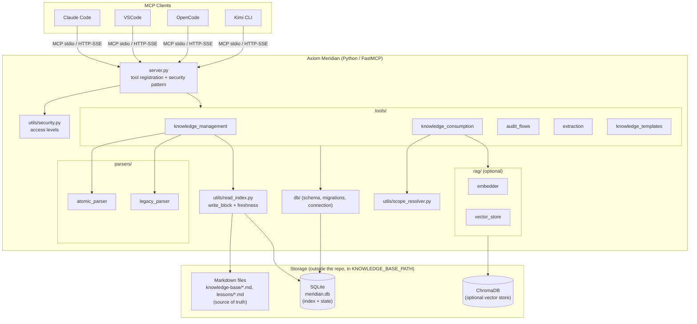
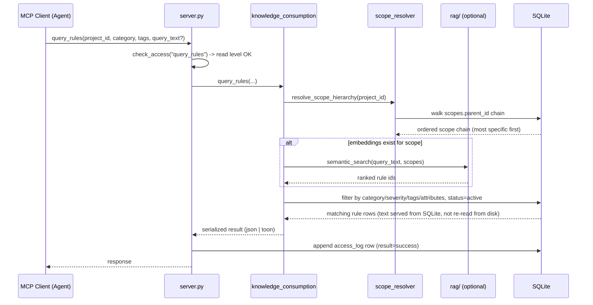
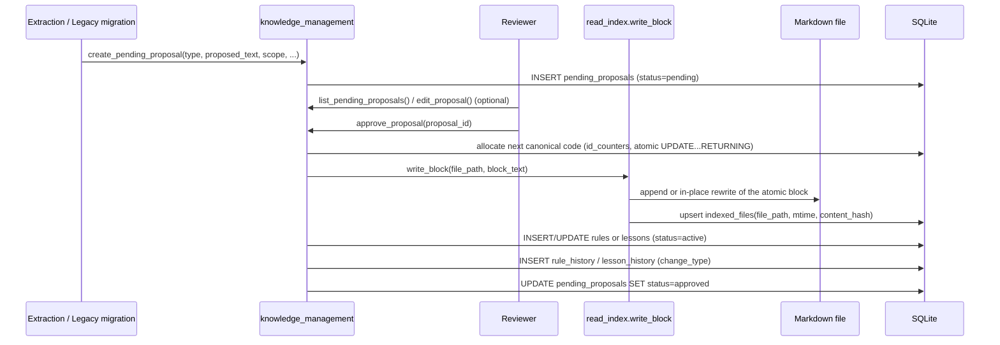

# System Architecture

## Guiding Principles

1. **Markdown is the source of truth. SQLite is only an index and state layer.** No tool may generate knowledge content that doesn't trace back to a `.md` file.
2. **Nothing is written without explicit human approval.** Extraction and legacy migration only ever create `pending_proposals`.
3. **Reads are served from the index, validated per file.** Full-text reads come from SQLite, with per-file freshness checks against the Markdown files — never a per-row re-read of disk.
4. **Scope hierarchy is resolved before every query.** More specific scopes take precedence over broader ones.
5. **Every rule/lesson is traceable** — which meeting originated it, which PR refined it, which lesson motivated it.
6. **SQL and semantic search (RAG) coexist.** Semantic ranking is used when embeddings exist; SQL filtering is the always-available fallback. The tool signature never changes between the two modes.

## High-Level View

## Layers

| Layer | Location | Responsibility |
|---|---|---|
| **Tool registration** | `server.py` | Registers every `@mcp.tool()`. Each tool is a thin wrapper delegating to `_security_pattern(tool_name, params, project_id, impl)`: allocate a sequential log id → `check_access()` → run the implementation → write an `access_log` row. New tools must follow this pattern and be registered in `TOOL_ACCESS_LEVELS`. |
| **Tools** | `tools/` | `knowledge_management` (indexing, proposal lifecycle, promotion, embeddings), `knowledge_consumption` (queries, context, timeline, audit log), `audit_flows` (PR audit, feedback analysis, feature checks), `extraction` (transcript → proposals), `knowledge_templates` (canonical block builders). |
| **Parsers** | `parsers/` | `atomic_parser` reads canonical `## RN-XXX-NNN` / `## LL-XXX-NNN` blocks. `legacy_parser` reads old free-form `###` files; legacy content only ever becomes a `pending_proposal`, never a direct row. |
| **RAG (optional)** | `rag/` | `embedder` lazily loads `BAAI/bge-small-en-v1.5` (384-dim, auto CUDA/MPS/CPU); `vector_store` wraps ChromaDB collections `meridian_rules` / `meridian_lessons`. Queries fall back to plain SQL when ChromaDB has no documents. |
| **Persistence** | `db/` | `schema.sql` (full schema + seed scopes), `migrations.py` (versioned `NNN_*.sql` runner against `PRAGMA user_version`, with automatic backup), `connection.py` (WAL-mode SQLite connections). |
| **Cross-cutting utils** | `utils/` | `security.py` (access levels), `scope_resolver.py` (hierarchy walk + attribute filtering), `read_index.py` (single write choke point + per-file freshness), `id_generator.py` (atomic sequential IDs), `privacy.py` (strip `<private>` tags before persistence), `serializers.py` (JSON/TOON output), `skill_generator.py` (`agentskills.io` output). |

## Read Path — `query_rules(project_id, ...)`

## Write Path — Proposal → Approval

## Security Model

| Access level | Grants | Typical caller |
|---|---|---|
| `read` | Queries only — nothing persisted. | Agents that only consume knowledge. |
| `analyze` (default) | `read` + audit/proposal persistence (`audit_pr`, `extract_*`, `create_pending_proposal`). | Normal development sessions. |
| `write` | Full access — indexing, approvals, embeddings, skill generation. | Administration and migration. |

- A higher level includes all lower levels.
- An insufficient level returns a structured `ACCESS_DENIED` error naming the required level.
- Every call — granted or denied — is recorded in `access_log`, excluding sensitive parameters (`pr_diff`, `feedback_text`, `text`, `proposed_text`, `new_text`).

## Transport

- **stdio (default)** — the parent process is the only possible caller; inherently local and trusted.
- **HTTP/SSE (`meridian serve <port>`)** — binds to `127.0.0.1` only, never `0.0.0.0`. A random session token is printed at startup and required as `Authorization: Bearer <token>` on every request; the token is never persisted and rotates on restart.

## Key Invariants (enforced across the codebase)

- **Indexed reads with per-file freshness.** `detail="full"` queries serve text from SQLite, never by re-reading the `.md` file per row. Freshness is checked once per distinct file (`indexed_files`: mtime fast path, sha256 arbiter on mismatch); a stale or unindexed file returns `STALE_INDEX` for every row backed by it.
- **`write_block` is the single place any knowledge file's bytes are written**, updating `indexed_files` in the same call so the index cannot drift from disk.
- **Scope resolution with conservative inclusion.** A rule with no attributes, or whose attribute key is absent on the project, is always included — dynamic attribute filtering (framework, component role, runtime version) only *narrows* when both sides define the key.
- **IDs are allocated atomically** from `id_counters` via `UPDATE ... RETURNING`, never by scanning the target table for `MAX(id)`.
- **Tag filtering is exact-match**, via normalized `rule_tags`/`lesson_tags` join tables, not substring `LIKE`.
- **`<private>` tags are stripped from all inbound text** before persistence, on every write path.

## Technology Stack

| Concern | Choice |
|---|---|
| Language / runtime | Python 3.11+ |
| MCP server framework | FastMCP |
| Relational storage | SQLite (WAL mode) |
| Vector store (optional) | ChromaDB |
| Embedding model (optional) | `BAAI/bge-small-en-v1.5` via `sentence-transformers` / `torch` |
| Serialization | JSON (default) or TOON (compact tabular, opt-in) |
| Packaging | `hatchling`, `uv` |
| Testing | `pytest`, `pytest-asyncio`; unit / integration / contract / benchmark suites |
| Linting | `ruff` (line length 100, target py311) |

## Architecture Decision Log

The following decisions shaped the current architecture and are the basis for the invariants above:

| # | Decision | Summary |
|---|---|---|
| ADR-001 | Response serialization format | JSON as the default MCP tool output format, TOON as an explicit opt-in for compact tabular data. |
| ADR-002 | Dynamic context attributes | `scope_attributes` / `rule_attributes` add AND-matched dynamic filtering with conservative inclusion, instead of hardcoding framework-specific columns. |
| ADR-003 | Legacy scope inference | Word-boundary matching (not substring) when inferring a scope from legacy free-form files during migration. |
| ADR-004 | Performance remediation, phase 1 | Introduced a real migration runner, replaced `MAX(id) LIKE`-based ID generation with atomic `id_counters`, and fixed an N+1 query in attribute filtering. |
| ADR-005 | Indexed read path, phase 2 | Moved full-text reads to SQLite with per-file freshness checks (`indexed_files`), added normalized `rule_tags`/`lesson_tags` for exact-match filtering, and introduced `write_block` as the single write choke point. |
| ADR-006 | Connection hardening & parser robustness | Added `busy_timeout` and early-commit handling for SQLite connection concurrency, and hardened the atomic parser against malformed blocks with clearer diagnostics. |

## Related Documents

- [Project Charter](01-project-charter.md)
- [Product Description](02-product-description.md)
- [Data Model](04-data-model.md)
- [User Stories](05-user-stories.md)
- [Work Tickets](06-work-tickets.md)
