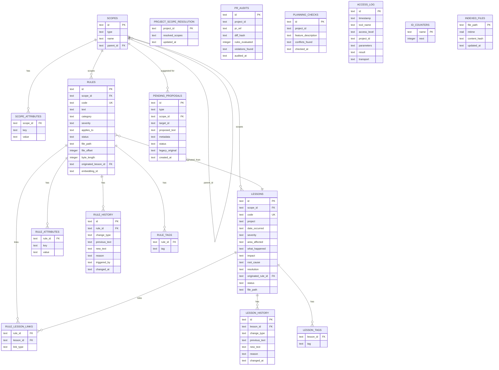
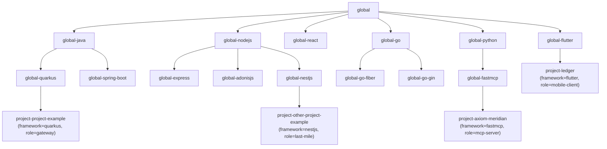

# Data Model

## Dual Source of Truth

Axiom Meridian deliberately splits knowledge across two stores that must never trade roles:

- **Markdown files** (`knowledge-base/**/*.md`, `lessons/**/*.md`) hold the canonical, human-readable text of every rule and lesson, in atomic blocks. They are what a human reads, reviews in a pull request, and edits by hand when needed.
- **SQLite** (`meridian.db`) is an index and state layer built *from* those files: it stores structured metadata (scope, category, severity, tags, status), history, proposals, and — for performance — a cached copy of each block's full text, always validated against the file's current mtime/hash before being served.

No tool may write knowledge content to SQLite that doesn't also exist as a block in a Markdown file.

## Entity-Relationship Diagram



## Table Reference

| Table | Purpose |
|---|---|
| `scopes` | Hierarchical nodes (`global`, `global-<framework>`, `project-<id>`) forming a parent chain used to resolve which rules apply to a given project. |
| `scope_attributes` | Dynamic key/value attributes on a scope (e.g. `framework=quarkus`, `component_role=gateway`) used for AND-matched filtering (ADR-002). |
| `rules` | Active/deprecated technical rules (`RN-<TECH>-NNN`), each bound to a scope, with category, severity, and applicability metadata. `text` is the cached full body served on `detail="full"` reads. |
| `rule_attributes` | Dynamic attributes on an individual rule, layered on top of its scope's attributes. |
| `rule_history` | Append-only audit trail of every change to a rule (`CREATED`, `UPDATED`, `DEPRECATED`, `PROMOTED`, ...). |
| `rule_tags` | Normalized one-row-per-tag table enabling exact-match tag filtering (replaces substring `LIKE` matching, ADR-005). |
| `lessons` | Incidents/lessons learned (`LL-<TECH>-NNN`) with structured fields (`what_happened`, `impact`, `root_cause`, `resolution`). |
| `lesson_history` | Append-only audit trail of lesson changes. |
| `lesson_tags` | Normalized tags for lessons, mirroring `rule_tags`. |
| `rule_lesson_links` | Bidirectional links between a rule and the lesson(s) that originated or reference it. |
| `project_scope_resolution` | Cache of the resolved scope chain for a project, to avoid recomputation on every query. |
| `pr_audits` | Record of every `audit_pr()` call: which rules were evaluated, which violations were found, against which diff. |
| `planning_checks` | Record of every `check_feature_against_rules()` call, for pre-implementation conflict detection. |
| `pending_proposals` | Staging area for every candidate rule/lesson (from extraction, legacy migration, or manual creation) awaiting human review. `target_id` is set for `type="update"` proposals that rewrite an existing block. |
| `access_log` | Security audit trail — every tool invocation, its required access level, and its outcome (`success` / `denied` / `error`). Sensitive parameters are never logged. |
| `id_counters` | Atomic counters backing sequential, human-readable ID generation (`RN-JAVA-004`, `LL-PSP-002`, ...) via `UPDATE ... RETURNING`. |
| `indexed_files` | Per-file freshness fingerprint (`mtime`, `content_hash`) used to validate that cached `rules.text`/`lessons.what_happened` still matches the Markdown file on disk. |

## Scope Hierarchy Example (Seed Data)



A query for `project-axiom-meridian` resolves, in precedence order, `project-axiom-meridian → global-fastmcp → global-python → global` — rules attached to any of those scopes are candidates, most specific first, further narrowed by matching attributes.

## Atomic Block Format

Rules and lessons live in Markdown as self-contained blocks. Field labels are load-bearing (parsed verbatim by `atomic_parser`):

```markdown
## RN-JAVA-011
**Scope:** global-java
**Categoría:** logging
**Severidad:** high
**Aplica a:** *.java
**Tags:** logging, observability
**Fuente:** meeting-2026-03-12
**Regla:** Never log full request bodies containing PII; redact before writing to any log sink.
```

```markdown
## LL-PSP-003
**Scope:** project-psp
**Proyecto:** psp
**Fecha:** 2026-02-18
**Severidad del impacto:** critical
**Área afectada:** payments
**Tags:** idempotency, retries
**Qué pasó:** A retried webhook double-charged a customer.
**Impacto:** Manual refund, customer trust incident.
**Causa raíz:** Retry logic lacked an idempotency key check.
**Resolución:** Added idempotency-key enforcement at the gateway.
**Originó regla:** RN-PSP-007
```

## ID Generation Strategy

Human-readable IDs (`RN-{TECH}-NNN`, `LL-{TECH}-NNN`, generic `prefix-NNNN`) are allocated from `id_counters(name, next)` via an atomic `UPDATE ... RETURNING`, never by scanning the target table for `MAX(id)` (that approach both raced under concurrent writers and sorted lexicographically, so `RN-JAVA-10` could be treated as "less than" `RN-JAVA-9` — see ADR-004). The `{TECH}` segment is derived from the scope ID, and counters are seeded once from real data on first migration.

## Indexed Read Freshness

`detail="full"` queries never re-read a `.md` file per row. Freshness is checked once per distinct file: the file's current `mtime` is compared against `indexed_files.mtime` (fast path); on a mismatch, a sha256 comparison arbitrates whether the content actually changed. A stale or unindexed file causes every row backed by it to return `text: None, error: "STALE_INDEX"` rather than silently serving outdated text (ADR-005).

## Related Documents

- [Project Charter](01-project-charter.md)
- [Product Description](02-product-description.md)
- [System Architecture](03-system-architecture.md)
- [User Stories](05-user-stories.md)
- [Work Tickets](06-work-tickets.md)
